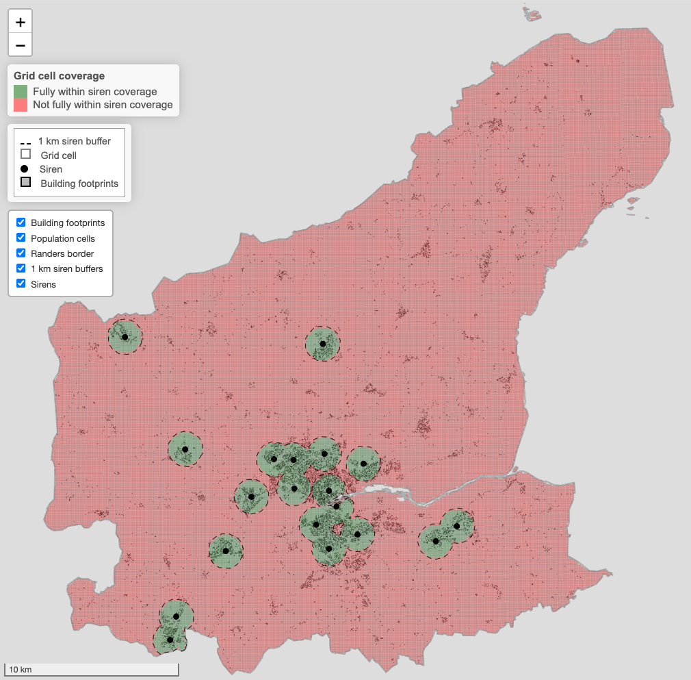
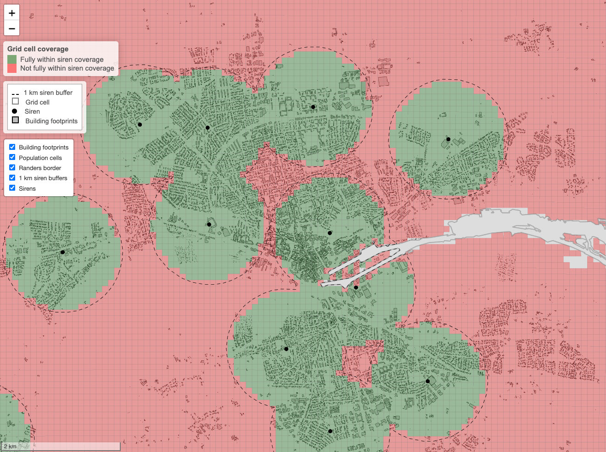
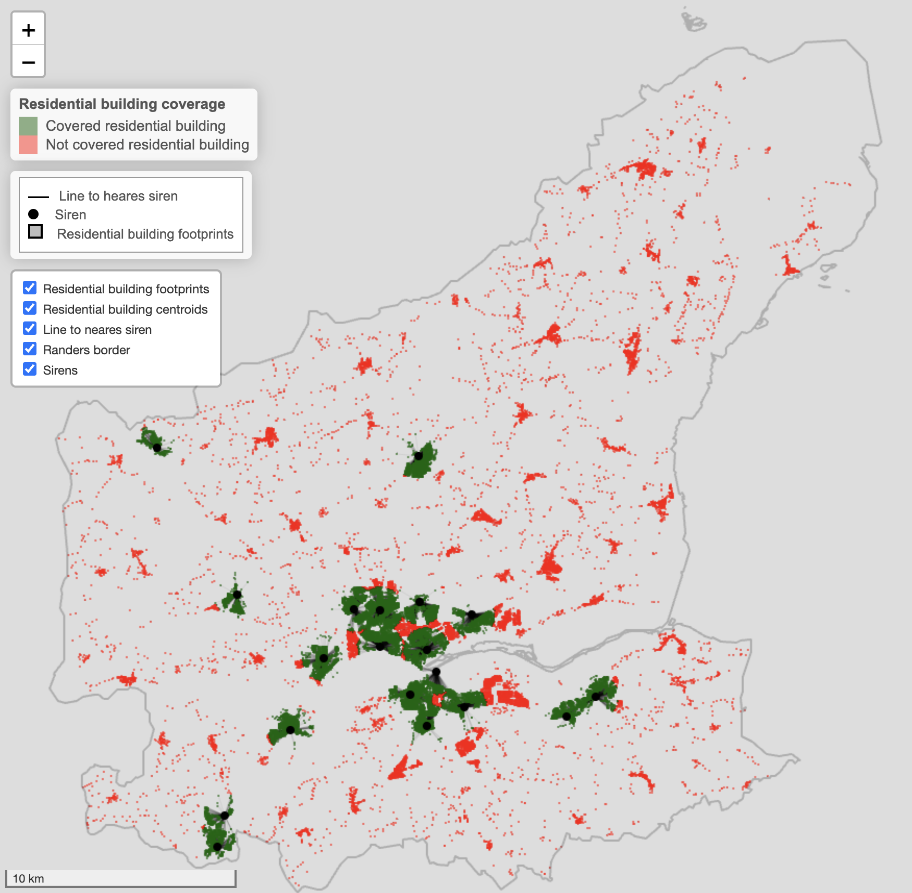
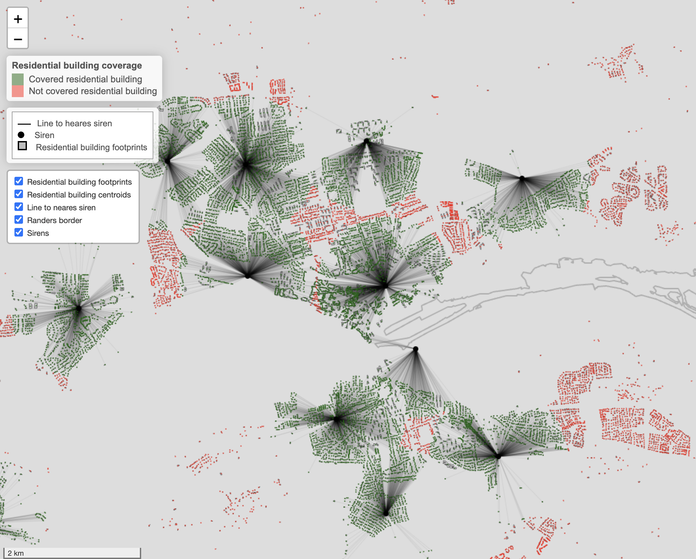

---
output:
  pdf_document: default
  html_document: default
---
# Spatial analysis of siren coverage in Randers Municipality
The main contribution of the repository is an R markdown script workflow which preprocess, analyze and maps spatial data related to siren coverage of the population of Randers Municipality.

The analysis and mapping is divided into two primary approaches. 

Firstly, population coverage is estimated using conservative cell map coverage, where only population within fully covered cells are counted. Producing an interactive Leaflet map, and a results csv with estimated counts. 

Secondly, population coverage is estimated using a building distribution approach where population within cells is allocated to residential buildings, and then coverage is estimated using building centroids. Again, producing an interactive Leaflet map, and a results csv with estimated counts. 

For the second approach approximately 9.2% of the population (8993) were not allocated to buildings, and as a result we are unable to attest to them being covered or not, which should be considered in interpretation of results. 

## Data, and data download guide
The input data is the following:

au_inspire.gpkg: which is the spatial boundary of Randers municipality: It is downloaded from Dataforsygningen, and is covered by CC BY 4.0, downloaded from this webpage: https://dataforsyningen.dk/data/992

sirener.kml: which is locations of sirens within Randers municipality. It is downloaded from a article of Randers Amtsavis: https://amtsavisen.dk/randers/her-er-sirenerne-i-randers-kommune

JRC-ESTAT_Census_Population_2021_100m.tif: which is a estimated 100x100 metre census population grid of 2021. This is not provided in the folder and need to be obtained. It should be downloaded and inserted as the folder it comes into the in folder from here: https://data.jrc.ec.europa.eu/dataset/98336641-fd1c-4992-8c7b-c470dd5eb81e

GEODKV_V3_Bygning_0730_TotalDownload_gpkg_Current_626.gpkg: which is building data for Randers Municipality. This is not provided in the folder and need to be obtained. It should be downloaded and inserted in the in folder. To download the data it is needed to create and administationsbruger at datafordeler.dk, get an api key and request data download. The specific download is "GeoDanmark Vektor Fildownload" and for the selections pick:  Bygning, Randers Kommune, Total download, Current, gpkg. For the generation time the one used in our analysis was "31/05/2026 00:09:03 Version 3", for reproduction it should be possible to use the latest version but might cause slight variation in results. Download here: https://datafordeler.dk/dataoversigt/

BBR_V3_Bygning_0730_TotalDownload_csv_Current_646.csv: which is BBR building associated data for Randers Municipality. This is not provided in the folder and need to be obtained. It should be downloaded and inserted in the in folder. To download the data it is needed to create and administationsbruger at datafordeler.dk, get an api key and request data download. The specific download is "BBR Fildownload" and for the selections pick:  Bygning, Randers Kommune, Total download, Current, csv. For the generation time the one used in our analysis was "29/05/2026 23:11:20 Version 3"", for reproduction it should be possible to use the latest version but might cause slight variation in results. Download here: https://datafordeler.dk/dataoversigt/


## Repo structure
```bash
in/
  └── au_inspire.gpkg     
  └── sirener.kml
  └── JRC-ESTAT_Census_Population_2021_100m
    └── JRC-ESTAT_Census_Population_2021_100m.pdf
    └── JRC-ESTAT_Census_Population_2021_100m.tif
  └── GEODKV_V3_Bygning_0730_TotalDownload_gpkg_Current_626.gpkg
  └── BBR_V3_Bygning_0730_TotalDownload_csv_Current_646.csv
out/
  └── randers_cell_coverage_map_files
    └── ...
  └── randers_cell_coverage_map.html
  └── results_part1_population_grid.csv
  └── randers_building_coverage_map_files
    └── ...
  └── randers_building_coverage_map.html
  └── results_part2_residential_building_population.csv
  └── map_screenshots
    └── ...
src/
  └── Spatial_clean.Rmd
README.md
```
## Screenshots of available leaflet maps

### Coservative population grid approach
[](randers_cell_coverage_map.html)

[](randers_cell_coverage_map.html)

### Residential building approach
[](randers_building_coverage_map.html)

[](randers_building_coverage_map.html)

## Summary of result table 

results_part1_population_grid:
| covered_conservative | cells | population | pct_population |
|---|---|---|---|
| FALSE | 70,768 | 39,944 | 40.8% |
| TRUE | 4,846 | 57,881 | 59.2% |

results_part2_residential_building_population*:
| covered | buildings | population | pct_population |
|---|---|---|---|
| FALSE | 13,789 | 30,291 | 34.1% |
| TRUE | 15,978 | 58,542 | 65.9% |

